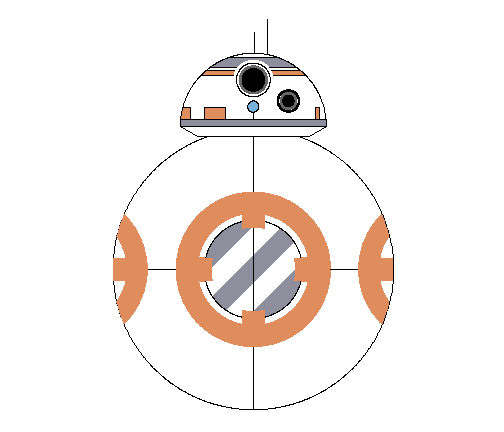

"GGplot2 is an R package created by Hadley Wickham in 2005. It can highly improve the quality and aesthetic of your graphs ! " (THE R GRAPH GALLERY)

Ejemplo: [The R graph gallery/DataArt](http://www.r-graph-gallery.com/144-droid-bb-8-data-art/)




--- .nobackground .quote
Other Examples

| Type | link |
| ------ | ------ |
| Barplot |  http://www.r-graph-gallery.com/80-circular-barplot/ |
|Stacked Barplot | http://www.r-graph-gallery.com/48-grouped-barplot-with-ggplot2/ |
| Histogram | http://www.r-graph-gallery.com/220-basic-ggplot2-histogram/ |
| Scatterplot | http://www.r-graph-gallery.com/50-51-52-scatter-plot-with-ggplot2|
| Text Labels | http://www.r-graph-gallery.com/275-add-text-labels-with-ggplot2/|
| Jitter | http://www.r-graph-gallery.com/47-groups-distribution-with-ggplot2/ |

---


                 


```r
publish(user = "SantiagoBarrios", repo = "slidify", host = 'https://github.com/SantiagoBarrios/slidify.git')
```

```
## Error in publish_deck(...): no se pudo encontrar la función "publish_deck"
```
